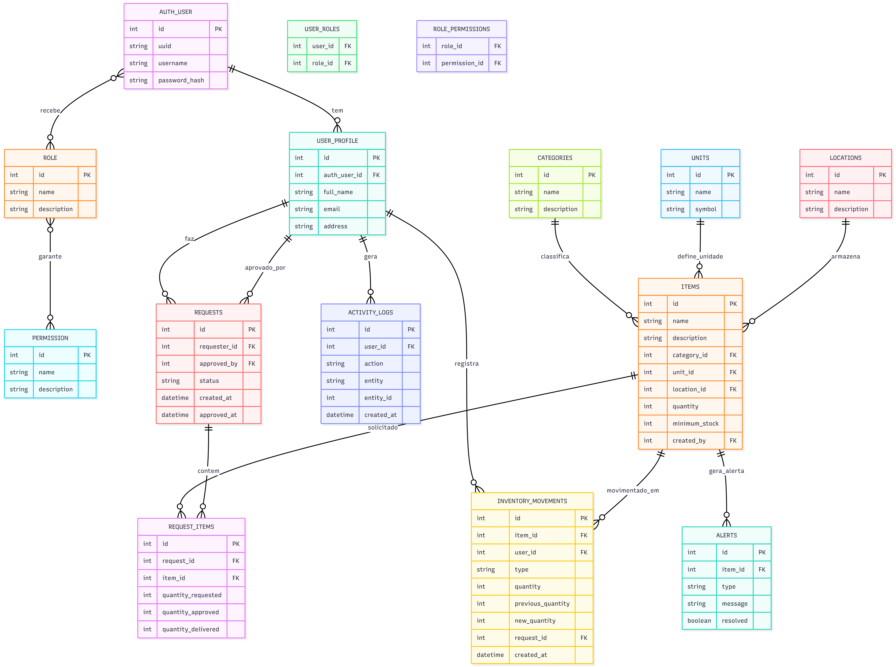
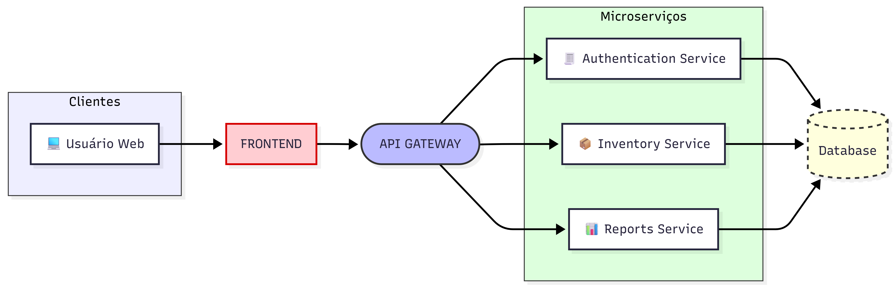

# Sistema de Inventário e Reserva para laboratórios 
Este projeto é um sistema de inventário desenvolvido em Flask, com controle de acesso baseado em cargos.
O sistema permite:
- Gerenciar usuários, perfis, cargos e permissões.
- Controlar requisições de itens, movimentações de estoque e alertas.
- Registrar logs de ações do usuário.

## Stack Atual

#### Backend

- Framework: Flask (Python 3.8.10)
- Arquitetura: Camada de Service, Repository e Model (camadas separadas)
- Banco de Dados: MySQL
- ORM: SQLAlchemy + Flask-Migrate (para migrations)
- Autenticação: JWT (com roles/permissões)
- Gerenciamento de sessão/DB: Custom session manager com retry e fechamento de conexão

#### Frontend
- Ainda não foi decidido a tecnologia

#### Extras

- Tratamento de DTOs com Pydantic
- Possível uso de tasks assíncronas (como Celery) para sincronização
- Controle de permissões e acesso nas rotas via JWT
- Alguns microserviços planejados (login, API, frontend), mas atualmente só um banco compartilhado

## Detalhe dos fluxos
1️⃣ Fluxo de Permissões (RBAC)
- Cada usuário (AUTH_USER) possui um perfil (USER_PROFILE).
- Cada usuário pode ter múltiplos cargos (ROLE).
- Cada cargo pode ter múltiplas permissões (PERMISSION).
- Rotas protegidas verificam permissões com decorators JWT

2️⃣Fluxo de Inventário
- Usuário cria uma requisição (REQUESTS) de um ou mais itens (REQUEST_ITEMS).
- A requisição pode ser aprovada por outro usuário.
- Cada item (ITEMS) pode ser movimentado (INVENTORY_MOVEMENTS) e auditado.
- Movimentações e ações do usuário são registradas em logs (ACTIVITY_LOGS).
- Alertas (ALERTS) podem ser gerados automaticamente quando quantidade mínima é atingida ou outras regras do sistema.

### Modelagem do banco
(https://mermaid.ai/d/41d57b72-4aa4-4d37-80f4-f1d6d6ca1fb3)

### Arquitetura dos microserviços
(https://mermaid.ai/d/7d4e3b1f-0352-4157-9ecd-f25267471612)
