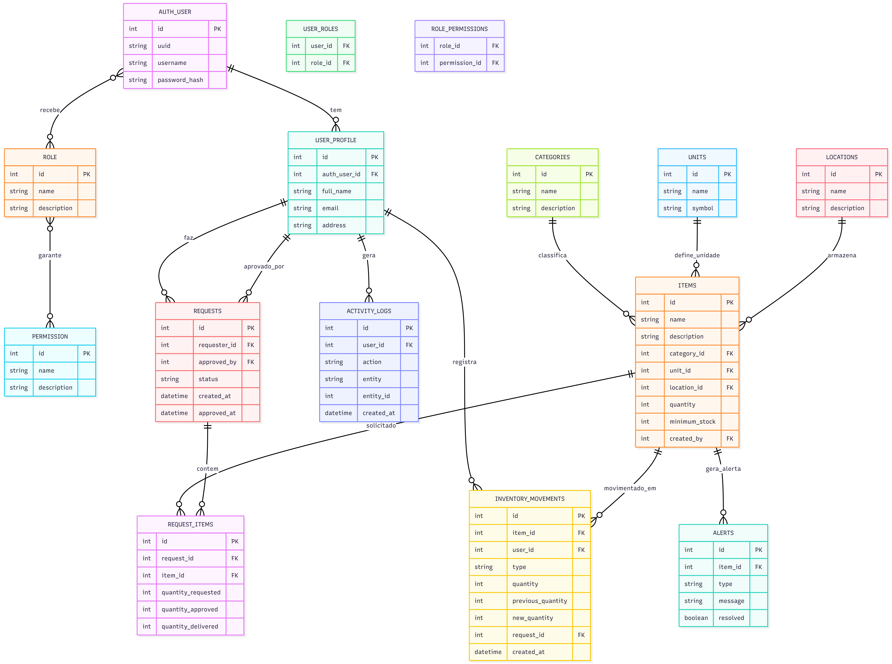

# Sistema de Inventário e Reserva para laboratórios 
Este projeto é um sistema de inventário desenvolvido em Flask, com controle de acesso baseado em cargos.
O sistema permite:
- Gerenciar usuários, perfis, cargos e permissões.
- Controlar requisições de itens, movimentações de estoque e alertas.
- Registrar logs de ações do usuário.

1️⃣ Fluxo de Permissões (RBAC)
- Cada usuário (AUTH_USER) possui um perfil (USER_PROFILE).
- Cada usuário pode ter múltiplos cargos (ROLE).
- Cada cargo pode ter múltiplas permissões (PERMISSION).
- Rotas protegidas verificam permissões com decorators JWT

2️⃣Fluxo de Inventário
- Usuário cria uma requisição (REQUESTS) de um ou mais itens (REQUEST_ITEMS).
- A requisição pode ser aprovada por outro usuário.
- Cada item (ITEMS) pode ser movimentado (INVENTORY_MOVEMENTS) e auditado.
- Movimentações e ações do usuário são registradas em logs (ACTIVITY_LOGS).
- Alertas (ALERTS) podem ser gerados automaticamente quando quantidade mínima é atingida ou outras regras do sistema.

